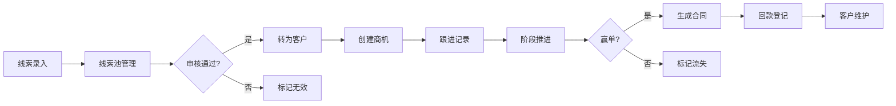

## 1. 产品概述

客户关系管理(CRM)纯前端演示应用，专为销售培训和方案展示场景设计，可完整模拟客户从线索到合同的全生命周期流程。

- **目标用户**：销售培训讲师、方案演示人员、销售团队
- **核心价值**：无需后端服务，即开即用的CRM演示环境，支持完整销售流程模拟
- **应用场景**：销售培训演练、产品方案展示、客户流程演示

## 2. 核心功能

### 2.1 用户角色
| 角色 | 登录方式 | 核心权限 |
|------|----------|----------|
| 演示用户 | 直接进入 | 全部功能操作、数据管理、环境重置 |

### 2.2 功能模块
1. **线索池**：线索录入、来源/行业筛选、线索转客户
2. **客户档案**：客户列表、联系人/决策人维护、合并重复客户、流失标记
3. **商机管理**：商机列表、阶段推进、预计金额与赢率、报价清单
4. **跟进记录**：电话拜访记录、下次跟进安排、跟进历史
5. **合同管理**：合同登记、回款计划、回款登记
6. **报表分析**：销售漏斗、业绩排行、数据统计
7. **系统设置**：字段显示配置、导入示例数据、重置演示环境

### 2.3 页面详情
| 页面名称 | 模块名称 | 功能描述 |
|---------|----------|----------|
| 线索池 | 线索列表 | 展示所有线索，支持分页和搜索 |
| 线索池 | 线索筛选 | 按来源、行业、状态筛选线索 |
| 线索池 | 新增线索 | 录入新线索，包含公司、联系人、来源等信息 |
| 线索池 | 转客户 | 将线索转换为正式客户并创建初始商机 |
| 客户档案 | 客户列表 | 展示所有客户，支持搜索和排序 |
| 客户档案 | 客户详情 | 查看客户基本信息、联系人、决策人 |
| 客户档案 | 联系人管理 | 添加、编辑、删除客户联系人 |
| 客户档案 | 合并客户 | 选择多个重复客户进行合并操作 |
| 客户档案 | 流失标记 | 标记客户流失并填写流失原因 |
| 商机管理 | 商机列表 | 展示所有商机，按阶段分组显示 |
| 商机管理 | 阶段推进 | 拖拽或点击推进商机阶段 |
| 商机管理 | 商机详情 | 编辑预计金额、赢率、预计成交日期 |
| 商机管理 | 报价清单 | 为商机添加产品报价项，自动计算总价 |
| 跟进记录 | 跟进列表 | 按时间线展示所有跟进记录 |
| 跟进记录 | 新增跟进 | 记录电话拜访、会议等跟进内容 |
| 跟进记录 | 下次跟进 | 设置下次跟进时间和提醒 |
| 合同管理 | 合同列表 | 展示所有合同及状态 |
| 合同管理 | 合同登记 | 新建合同，关联客户和商机 |
| 合同管理 | 回款计划 | 设置分期回款计划 |
| 合同管理 | 回款登记 | 登记实际回款金额和时间 |
| 报表分析 | 销售漏斗 | 按阶段展示商机数量和金额漏斗图 |
| 报表分析 | 个人排行 | 销售人员业绩排行榜 |
| 报表分析 | 数据统计 | 关键指标统计卡片 |
| 系统设置 | 字段配置 | 配置各模块显示的字段 |
| 系统设置 | 数据导入 | 一键导入示例数据 |
| 系统设置 | 环境重置 | 清空所有数据，重置为初始状态 |

## 3. 核心流程

### 3.1 销售全流程
销售线索录入 → 线索资格审核 → 转换为客户 → 创建商机 → 持续跟进 → 商机阶段推进 → 生成报价 → 签订合同 → 回款登记 → 客户维护

## 4. 用户界面设计

### 4.1 设计风格
- **主色调**：深海蓝 (#1e40af)，体现专业商务感
- **辅助色**：翡翠绿 (#059669) 表示成功/进展，琥珀橙 (#d97706) 表示警告/待办，玫瑰红 (#e11d48) 表示流失/风险
- **中性色**： slate 色系，从 #f8fafc 到 #0f172a
- **按钮风格**：圆角6px，轻微阴影，悬停有微妙的上浮效果
- **字体**：标题使用 "Noto Sans SC"，正文使用系统无衬线字体
- **布局风格**：左侧导航栏 + 顶部工具栏 + 主内容区的经典后台布局
- **卡片设计**：白色卡片，8px圆角，轻量阴影，边框极细
- **图标风格**：使用 Lucide React 线性图标

### 4.2 页面设计概览
| 页面名称 | 模块名称 | UI元素 |
|---------|----------|--------|
| 线索池 | 顶部筛选栏 | 下拉筛选器、搜索框、新增按钮 |
| 线索池 | 线索表格 | 数据表格、行操作按钮、分页器 |
| 客户档案 | 客户列表 | 卡片式列表/表格切换、筛选标签 |
| 客户档案 | 详情侧边栏 | 滑出式面板、标签页切换 |
| 商机管理 | 看板视图 | 拖拽式阶段看板、商机卡片 |
| 商机管理 | 报价编辑 | 可编辑表格、自动计算、金额格式化 |
| 跟进记录 | 时间线 | 垂直时间线、类型标签、跟进内容 |
| 合同管理 | 合同卡片 | 状态徽章、进度条、回款信息 |
| 报表分析 | 图表区 | 漏斗图、柱状图、统计卡片网格 |
| 系统设置 | 设置分组 | 分组标签、开关控件、操作按钮 |

### 4.3 响应式
- 桌面优先设计，适配 1440px 及以上宽屏
- 平板端 (768px-1024px)：导航栏折叠为图标模式
- 移动端 (＜768px)：底部导航栏，内容单列布局
- 表格在小屏幕下支持横向滚动

### 4.4 动画与交互
- 页面切换：淡入淡出过渡，200ms
- 侧边栏滑出：从右向左滑动，300ms 缓动
- 按钮/卡片悬停：轻微上浮 + 阴影加深
- 数据加载：骨架屏占位
- 操作反馈：顶部轻量提示条 (Toast)
