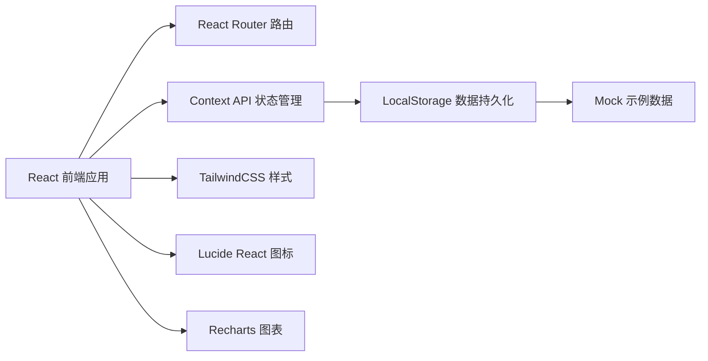
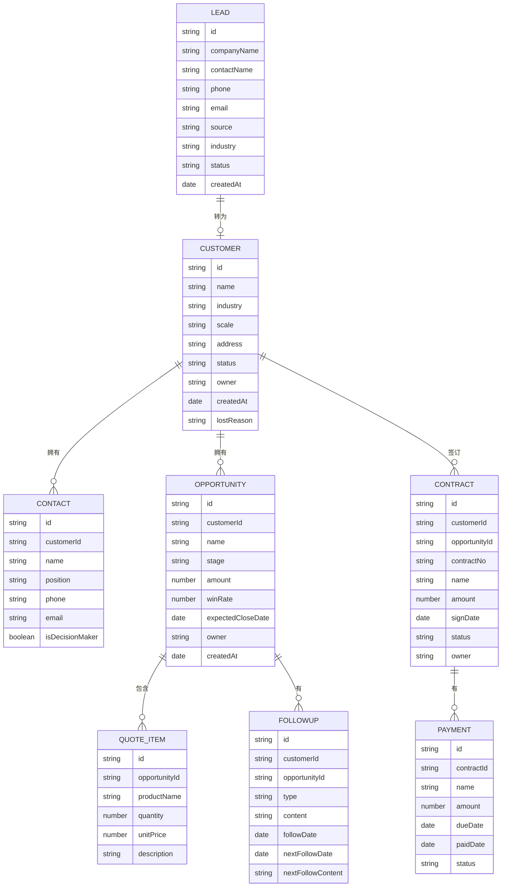

## 1. 架构设计



纯前端单页应用，所有数据存储在浏览器 LocalStorage 中，无需后端服务。

## 2. 技术描述

- **前端框架**：React@18 + TypeScript
- **构建工具**：Vite@5
- **样式方案**：TailwindCSS@3
- **路由管理**：React Router DOM@6
- **状态管理**：React Context API + useReducer
- **数据持久化**：LocalStorage
- **图表库**：Recharts
- **图标库**：Lucide React
- **后端服务**：无（纯前端）
- **数据库**：无（浏览器本地存储）

## 3. 路由定义

| 路由路径 | 页面名称 | 说明 |
|---------|---------|------|
| / | 线索池 | 默认首页，展示线索列表 |
| /leads | 线索池 | 线索管理页面 |
| /customers | 客户档案 | 客户管理页面 |
| /opportunities | 商机管理 | 商机看板页面 |
| /followups | 跟进记录 | 跟进时间线页面 |
| /contracts | 合同管理 | 合同列表页面 |
| /reports | 报表分析 | 数据报表页面 |
| /settings | 系统设置 | 设置配置页面 |

## 4. 数据模型

### 4.1 实体关系图



### 4.2 数据常量定义

**线索来源 (LeadSource)**:
- 官网注册、市场活动、转介绍、 Cold Call、展会、其他

**行业类型 (Industry)**:
- 互联网、金融、制造业、教育、医疗、零售、其他

**线索状态 (LeadStatus)**:
- 新建、跟进中、已转化、已无效

**客户状态 (CustomerStatus)**:
- 活跃、休眠、流失

**商机阶段 (OpportunityStage)**:
- 初步接触、需求确认、方案报价、商务谈判、合同签订、赢单、输单

**商机阶段 (OpportunityStage)**:
- 初步接触、需求确认、方案报价、商务谈判、赢单、输单

**合同状态 (ContractStatus)**:
- 待签订、执行中、已完成、已终止

**回款状态 (PaymentStatus)**:
- 待回款、已回款、已逾期

**跟进类型 (FollowupType)**:
- 电话、会议、邮件、拜访、其他

## 5. 项目目录结构

```
src/
├── assets/          # 静态资源
├── components/    # 通用组件
│   ├── Layout/    # 布局组件
│   ├── UI/        # 基础UI组件
│   └── ...        # 业务组件
├── context/       # Context 状态管理
├── data/          # Mock 示例数据
├── hooks/         # 自定义 Hooks
├── pages/         # 页面组件
│   ├── Leads/
│   ├── Customers/
│   ├── Opportunities/
│   ├── Followups/
│   ├── Contracts/
│   ├── Reports/
│   └── Settings/
├── types/         # TypeScript 类型定义
├── utils/         # 工具函数
├── App.tsx
├── main.tsx
└── index.css
```

## 6. 核心功能实现方案

### 6.1 状态管理
- 使用 React Context API 提供全局数据状态
- 分为多个 Context：LeadContext、CustomerContext、OpportunityContext 等
- 使用 useReducer 处理复杂状态变更
- 初始化时从 LocalStorage 读取数据，变更时自动持久化

### 6.2 数据持久化
- 自定义 useLocalStorage hook 封装读写操作
- 每个数据模块独立存储 key
- 提供数据变更后自动同步到 LocalStorage

### 6.3 报表图表
- 使用 Recharts 实现销售漏斗图、柱状图
- 数据聚合函数独立封装
- 支持金额格式化（万元单位）

### 6.4 表单与交互
- 受控组件实现表单
- 滑出式侧边栏（SlidePanel 组件）
- Toast 消息提示
- 确认对话框
